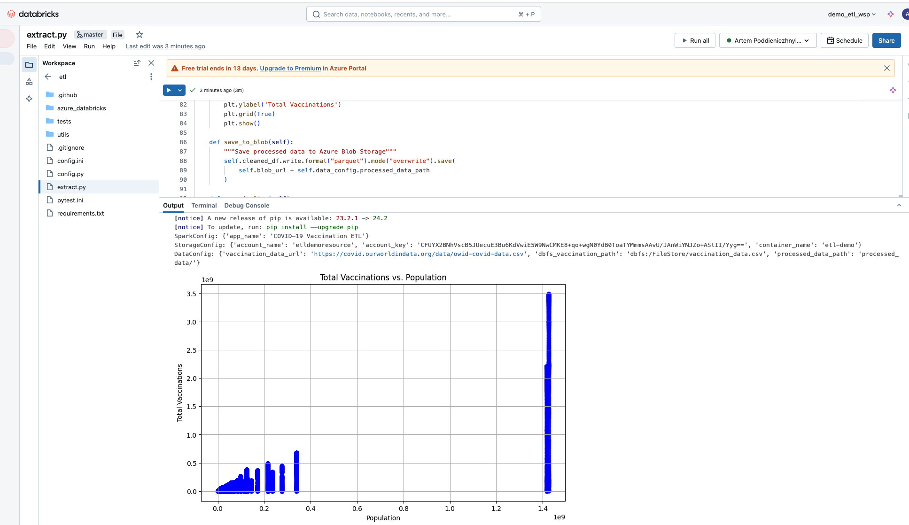

# COVID-19 Vaccination Data ETL Pipeline

This project demonstrates an efficient ETL (Extract, Transform, Load) pipeline for processing COVID-19 vaccination data using Azure Databricks, PySpark, and various Azure services. The pipeline includes comprehensive testing, infrastructure as code, and data quality validation.

## Project Overview

The pipeline processes COVID-19 vaccination data through the following steps:
1. Downloads data from a public source
2. Performs data cleaning and transformation using PySpark
3. Creates visualizations for data analysis
4. Stores processed data in Azure Blob Storage
5. Validates data quality using Great Expectations


### Data Processing Visualization


The solution leverages:
- Azure Databricks for data processing
- Azure Blob Storage for data storage
- Terraform for infrastructure provisioning
- GitHub Actions for CI/CD
- Great Expectations for data quality validation

## Setup

### Prerequisites

- Azure subscription
- Terraform installed
- Python 3.8+
- Azure CLI

### Installation

1. Clone the repository

2. Install Python dependencies:
 ```bash
   pip install -r requirements.txt
   ```

3. Configure Azure infrastructure:
   - Navigate to the Terraform directory:
   ```bash
   cd azure_databricks
   ```
   - Initialize Terraform:
   ```bash
   terraform init
   ```
   - Review the infrastructure plan:
   ```bash
   terraform plan
   ```
   - Apply the configuration:
   ```bash
   terraform apply
   ```

4. Set up configuration files:
   - Update `config.ini` with your Azure credentials:
   ```ini
   [storage]
   account_name = your_storage_account
   account_key = your_storage_key
   container_name = etl-demo

   [databricks]
   host = your_databricks_workspace_url
   token = your_databricks_token
   job_id = your_job_id
   ```

5. Configure GitHub Actions (optional):
   - Navigate to your repository settings
   - Add the following secrets:
    - `DATABRICKS_URL`
    - `DATABRICKS_TOKEN`
    - `STORAGE_ACCOUNT_NAME`
    - `STORAGE_ACCOUNT_KE`
    - `DATABRICKS_JOB_ID`

6. Create workspace in Databricks, and configure Job

7. Verify installation:
   - Run the test suite:
   ```bash
   pytest tests/
   ```
   - Run a sample ETL job:
   ```bash
    python extract.py
   ```